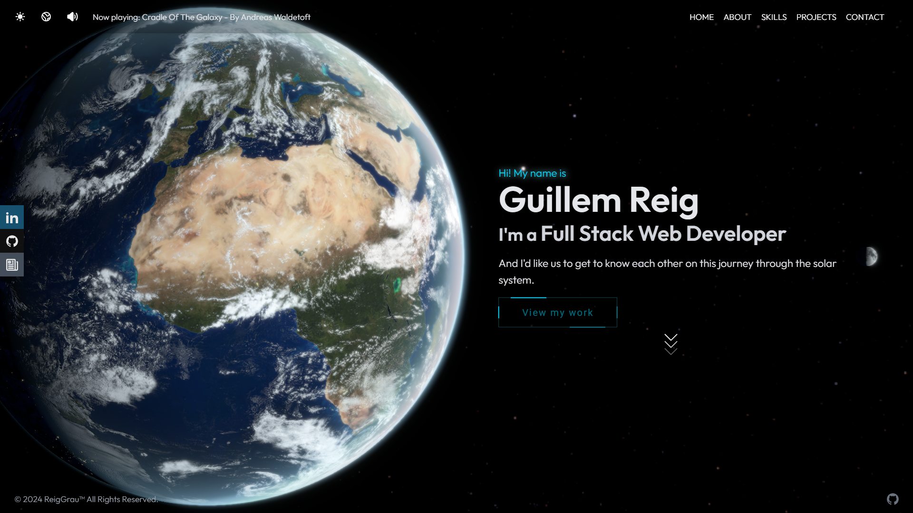
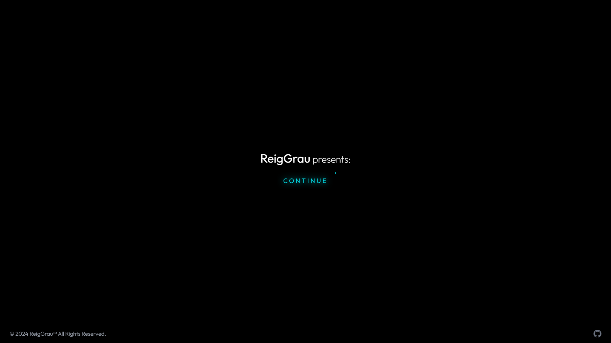
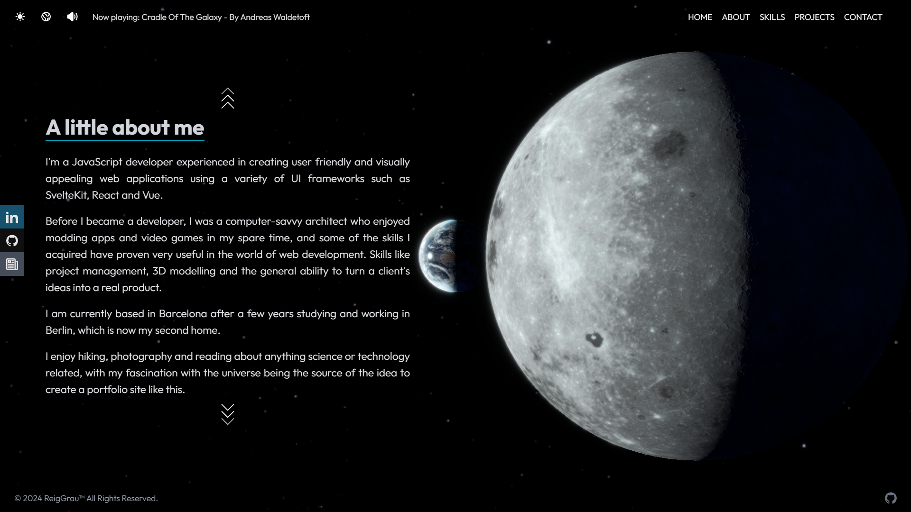
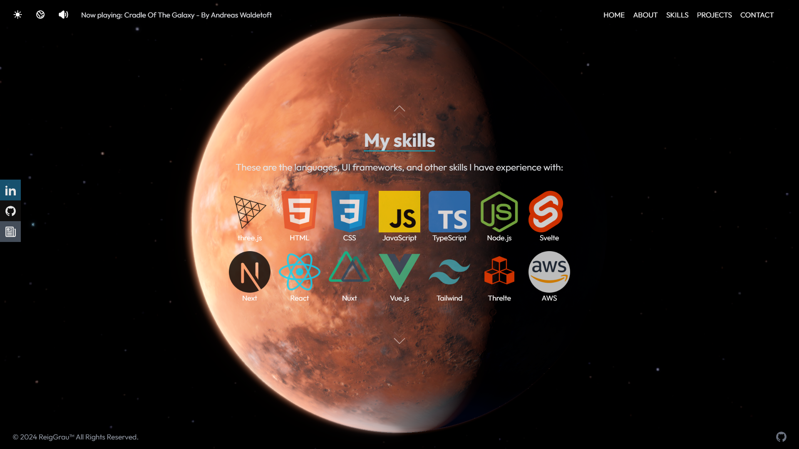
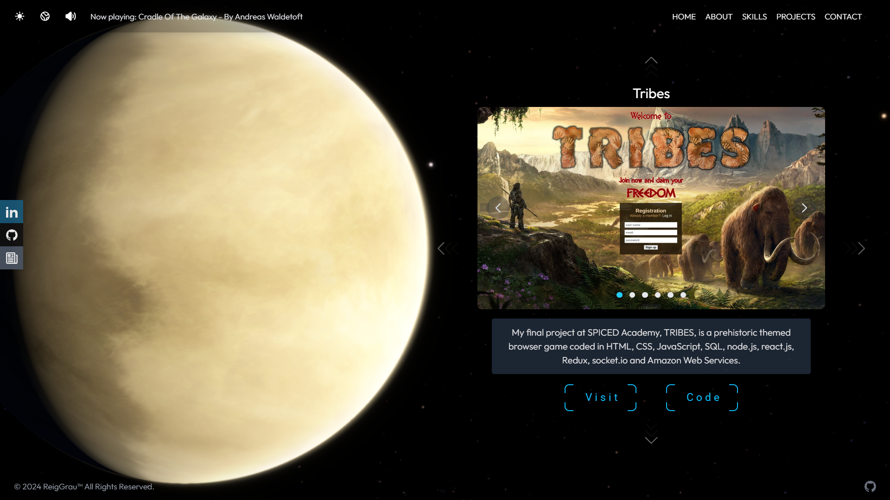
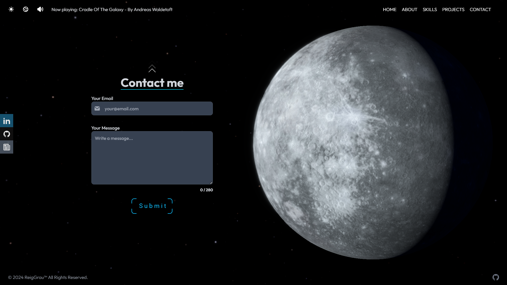
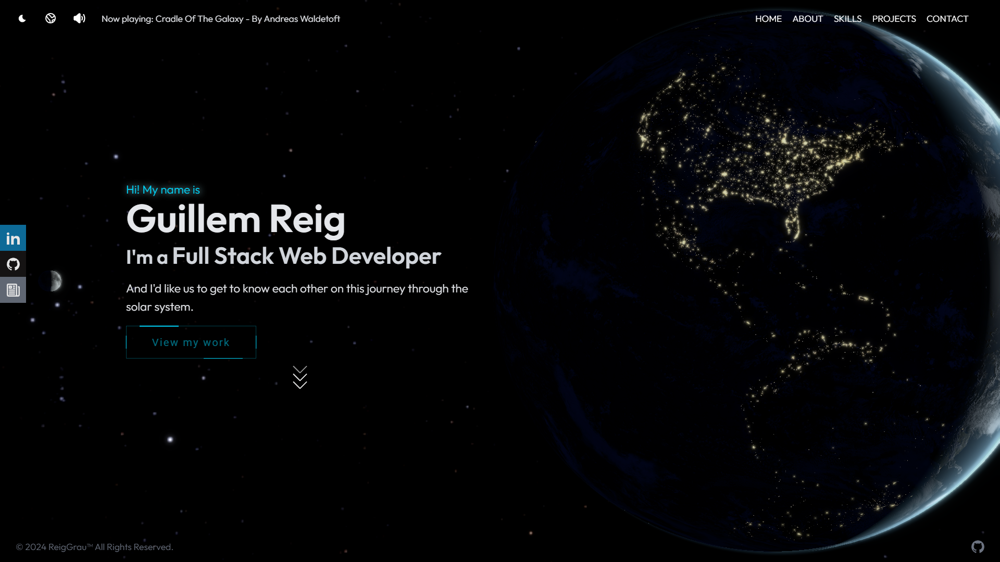
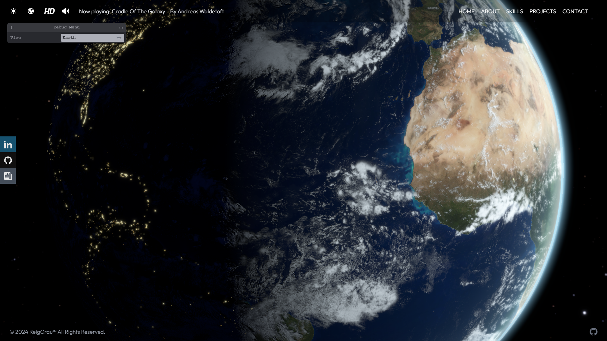

# ReigGrau — 3D Solar System Portfolio

An interactive developer portfolio built as a 3D solar system, where each planet represents a different section of the site. Navigate between planets to explore who I am, what I do, and what I've built.



## Live Demo

> **[reiggrau.com](https://reiggrau-portfolio.vercel.app/)**

---

## Overview

This isn't a typical portfolio. Instead of scrolling through flat pages, visitors travel through space — from Earth to Mercury — each planet hosting a section of the portfolio with its own atmosphere, textures, and lighting.

The entire 3D scene runs in the browser using **Three.js** via **Threlte**, with custom GLSL shaders for atmospheres, sky glow, and Earth's city lights on the dark side. Textures are progressively loaded, and the scene adapts between mobile, desktop, and HD resolutions.

### Planet → Section mapping

| Planet    | Section      | Description                                       |
| --------- | ------------ | ------------------------------------------------- |
| 🌍 Earth  | **Home**     | Landing page with introduction                    |
| 🌙 Moon   | **About**    | Background, experience, and personal interests    |
| 🔴 Mars   | **Skills**   | Technical skill showcase                          |
| 🪐 Venus  | **Projects** | Project carousel with live demos and source links |
| ☿️ Mercury | **Contact**  | Email contact form                                |

---

## Screenshots















---

## Features

- **3D Solar System Navigation** — Travel between planets using the navbar, keyboard shortcuts (`1`–`5`, `↑`/`↓`), or mobile menu
- **Custom GLSL Shaders** — Atmosphere halos, sky glow with directional lighting, and Earth night-side city lights with terminator fade
- **Progressive Loading** — Earth loads first with a cinematic intro screen; remaining planets load in the background after user interaction
- **Responsive Textures** — Automatically serves mobile, desktop, or HD texture sets based on device and user preference
- **Dark Mode** — Toggles color scheme and shifts the camera perspective
- **Post-Processing** — Bloom and SMAA anti-aliasing via EffectComposer
- **Contact Form** — Server-side email delivery through the Resend API
- **Ambient Music** — Optional background soundtrack activated on user interaction

---

## Tech Stack

| Category            | Technologies                                                            |
| ------------------- | ----------------------------------------------------------------------- |
| **Framework**       | SvelteKit 2, Svelte 4, TypeScript                                       |
| **3D / WebGL**      | Three.js, Threlte (@threlte/core, @threlte/extras), custom GLSL shaders |
| **Styling**         | Tailwind CSS 3, Flowbite Svelte                                         |
| **Post-Processing** | postprocessing (Bloom, SMAA)                                            |
| **Animation**       | Theatre.js, Svelte spring/motion                                        |
| **Backend**         | SvelteKit server actions, Resend (email API)                            |
| **Build**           | Vite 5, @sveltejs/adapter-auto                                          |

---

## Getting Started

### Prerequisites

- Node.js 18+
- npm

### Installation

```bash
git clone https://github.com/reiggrau/portfolio-svelte.git
cd portfolio-svelte
npm install
```

### Development

```bash
npm run dev
```

Opens at [http://localhost:5173](http://localhost:5173).

### Production Build

```bash
npm run build
npm run preview
```

### Environment Variables

Create a `.env` file in the project root:

```
RESEND_API_KEY=your_resend_api_key
```

Required for the contact form email functionality.

---

## Project Structure

```
src/
├── lib/
│   ├── components/
│   │   ├── threlte/          # 3D planet components + scene + renderer
│   │   ├── theater/          # Content sections (Home, About, Skills, Projects, Contact)
│   │   └── navbar/           # Navigation sub-components
│   ├── shaders/              # Custom GLSL vertex/fragment shaders
│   ├── stores/               # Svelte stores (app state, threlte state)
│   └── assets/               # Skill logos and static images
├── routes/
│   ├── +page.svelte          # Main page
│   └── +page.server.ts       # Contact form server action
└── static/
    └── textures/             # Planet textures (mobile / desktop / HD)
```

---

## Author

**Guillem Reig Grau** — Full Stack Web Developer based in Barcelona

- [LinkedIn](https://www.linkedin.com/in/reig-grau/)
- [GitHub](https://github.com/reiggrau)
